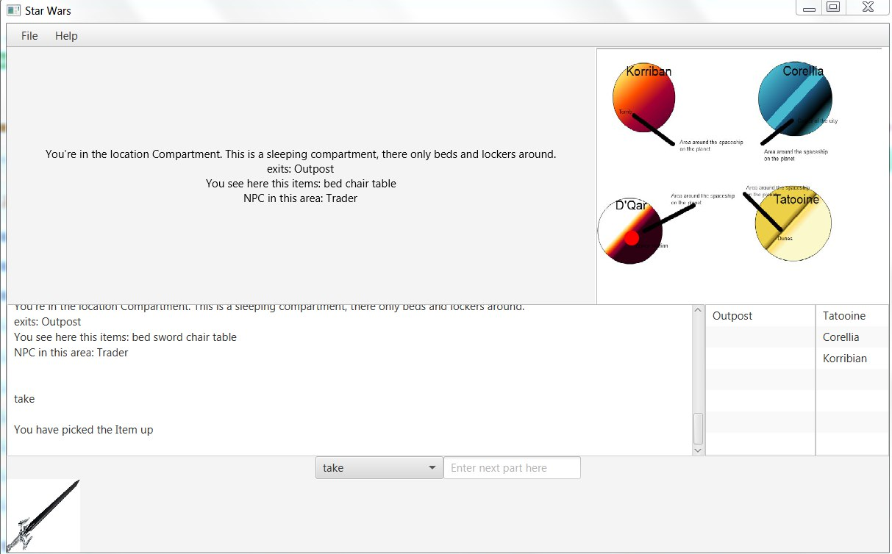

An adventure game with RPG elements inspired by Star Wars movies and games. Made as school projects by me. To move between location use 
LMB doubleclick. You can choose the command you want to make from combobox at the bottom of the screen. In the text area next to it you 
should write the name of object/person you want to interact with. For example: "open Door password" or "talk Justin" or "take sword" etc. 

You can see how does gui look like here: 

